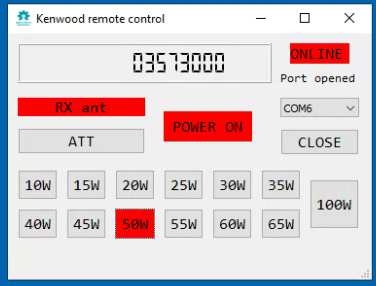
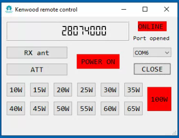

# Kenwood transceiver remote control software
More information - https://ra0sms.com/kenwood-control-software/

The program replaces the standard program for controlling the Kenwood ARCP590 transceiver. It has limited functionality, but works noticeably faster than the original software.

Based on Python3 and PyQt5 library. If you want you can change the source code for your desires.

